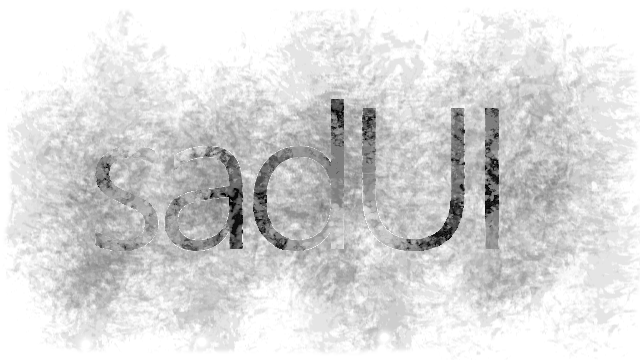

# sadUI Alpha / NLUE
> prj dropped: 22:44 03/09/2019 \
> review build

Back in 2015, from time to time I developed my vision of a graphical shell of the operating system Windows, but my UI-pranks after grew into something more and went into commercially successful projects and this child became a ~~kind of~~ playground for my creativity and quick testing of ideas, and then the project just died under a layer of dust and was abandoned.

At this moment I think that is biggest archive of the original and recoded versions of many popular tools and libraries on old `RAD DevelStudio`. Many of them can be used in `DevelNext` or in any `PHPj` or `PHPEx` since 5.3.

**Also, u can see last build of the UI.**

###### Well, here u are. Good luck.

___
#DevelStudio #DevelNext #RAD #PHP #Project

